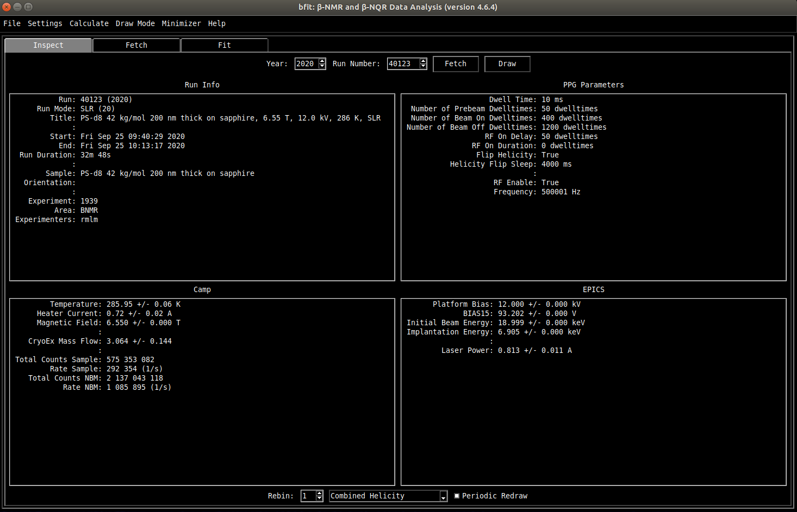

<!--
JOSS welcomes submissions from broadly diverse research areas. For this reason, we require that authors include in the paper some sentences that explain the software functionality and domain of use to a non-specialist reader. We also require that authors explain the research applications of the software. The paper should be between 250-1000 words.

Your paper should include:

    A list of the authors of the software and their affiliations, using the correct format (see the example below).
    A list of key references, including to other software addressing related needs. Note that the references should include full names of venues, e.g., journals and conferences, not abbreviations only understood in the context of a specific discipline.
    Mention (if applicable) a representative set of past or ongoing research projects using the software and recent scholarly publications enabled by it.
-->

---
title: 'bfit: A Python Application For Beta-Detected NMR'
tags:
  - Python
  - beta-detected NMR
authors:
  - name: Derek Fujimoto
    orcid: 0000-0003-2847-2053
    affiliation: "1,2"
affiliations:
 - name: Stewart Blusson Quantum Matter Institute, University of British Columbia, Vancouver, BC V6T 1Z4, Canada
   index: 1
 - name: Department of Physics and Astronomy, University of BritishColumbia, Vancouver, BC V6T 1Z1, Canada
   index: 2
date: 17 May 2021
bibliography: paper.bib
---

# Summary

<!---A summary describing the high-level functionality and purpose of the software for a diverse, non-specialist audience.
MAKE IT SPECIFIC TO BNMR
--->
The first muon spin rotation ($\mu$SR) measurements were recorded in 1957, at the Nevis cyclotron in the United States of America.[@Garwin1957a,@Garwin2003] While the field has thrived over its long history, the technique remains restricted to large nationally-supported facilities.[@Brewer2012] Today, there are only a handful of locations capable of producing the particle beam needed to conduct $\mu$SR, including: TRIUMF, Canada; ISIS, located in the United Kingdom; PSI in Switzerland; and the Japanese facility J-PARC. The MUD file format is used to store $\mu$SR data taken at TRIUMF. [@Whidden1994] This is a self-describing binary format (i.e., not ASCII), containing the measurement data, device settings, experimental conditions such as the temperature or the magnetic field, and some metadata. 

As with many older science applications, the MUD file API is written in C and FORTRAN. These statically-typed and compiled languages are known for their computational efficiency, but can be difficult to work with. This is perhaps one of the reasons why scientific computing has, in many communities, shifted to more modern languages such as Python: a dynamically-typed and interpreted language. As a result, Python has amassed a massive library of data analysis tools.[@Virtanen2020,@McKinney2010] The primary advantage of Python is the short development time of programs written in the language. This is particularly important in the context of scientific analysis, which are typically run only a few times by select individuals. As a result, the time taken to write the analysis code is a large part of the program's effective run time. The aim of this work is to bring this rapid prototyping style of analysis to the $\mu$SR and beta-detected NMR ($\beta$-NMR) communities. 

# Statement of need

A Statement of Need section that clearly illustrates the research purpose of the software.
Cite like this: [@Fujimoto2019]

# Mathematics

Single dollars ($) are required for inline mathematics e.g. $f(x) = e^{\pi/x}$

Double dollars make self-standing equations:

$$\Theta(x) = \left\{\begin{array}{l}
0\textrm{ if } x < 0\cr
1\textrm{ else}
\end{array}\right.$$

You can also use plain \LaTeX for equations
\begin{equation}\label{eq:fourier}
\hat f(\omega) = \int_{-\infty}^{\infty} f(x) e^{i\omega x} dx
\end{equation}
and refer to \autoref{eq:fourier} from text.

# Citations

Citations to entries in paper.bib should be in
[rMarkdown](http://rmarkdown.rstudio.com/authoring_bibliographies_and_citations.html)
format.

# Figures

Figures can be included like this:

and referenced from text using \autoref{fig:example}.

Figure sizes can be customized by adding an optional second parameter:
{ width=20% }

# Acknowledgements

Acknowledgement of any financial support.

# References