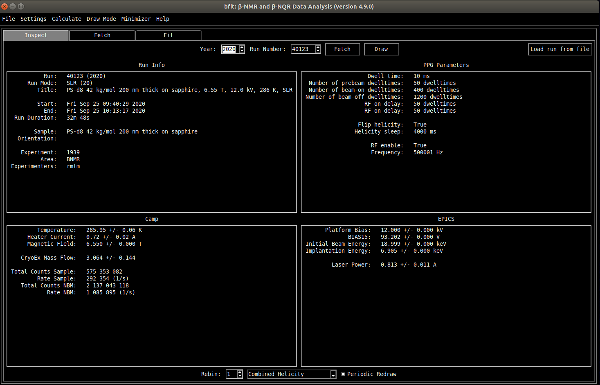

<!--
JOSS welcomes submissions from broadly diverse research areas. For this reason, we require that authors include in the paper some sentences that explain the software functionality and domain of use to a non-specialist reader. We also require that authors explain the research applications of the software. The paper should be between 250-1000 words.

Your paper should include:

    A list of the authors of the software and their affiliations, using the correct format (see the example below).
    A list of key references, including to other software addressing related needs. Note that the references should include full names of venues, e.g., journals and conferences, not abbreviations only understood in the context of a specific discipline.
    Mention (if applicable) a representative set of past or ongoing research projects using the software and recent scholarly publications enabled by it.
-->

---
title: 'bfit: A Python Application For β-NMR Analysis'
tags:
  - Python
  - beta-detected NMR
authors:
  - name: Derek Fujimoto
    orcid: 0000-0003-0872-7098
    affiliation: "1,2"
affiliations:
 - name: Stewart Blusson Quantum Matter Institute, University of British Columbia, Vancouver, BC V6T 1Z4, Canada
   index: 1
 - name: Department of Physics and Astronomy, University of BritishColumbia, Vancouver, BC V6T 1Z1, Canada
   index: 2
date: 17 May 2021
bibliography: paper.bib
---

# Summary

A summary describing the high-level functionality and purpose of the software for a diverse, non-specialist audience.

# Statement of need

A Statement of Need section that clearly illustrates the research purpose of the software.
Cite like this: [@Fujimoto2019]

# Mathematics

Single dollars ($) are required for inline mathematics e.g. $f(x) = e^{\pi/x}$

Double dollars make self-standing equations:

$$\Theta(x) = \left\{\begin{array}{l}
0\textrm{ if } x < 0\cr
1\textrm{ else}
\end{array}\right.$$

You can also use plain \LaTeX for equations
\begin{equation}\label{eq:fourier}
\hat f(\omega) = \int_{-\infty}^{\infty} f(x) e^{i\omega x} dx
\end{equation}
and refer to \autoref{eq:fourier} from text.

# Citations

Citations to entries in paper.bib should be in
[rMarkdown](http://rmarkdown.rstudio.com/authoring_bibliographies_and_citations.html)
format.

If you want to cite a software repository URL (e.g. something on GitHub without a preferred
citation) then you can do it with the example BibTeX entry below for @fidgit.

For a quick reference, the following citation commands can be used:
- `@author:2001`  ->  "Author et al. (2001)"
- `[@author:2001]` -> "(Author et al., 2001)"
- `[@author1:2001; @author2:2001]` -> "(Author1 et al., 2001; Author2 et al., 2002)"

# Figures

Figures can be included like this:

and referenced from text using \autoref{fig:example}.

Figure sizes can be customized by adding an optional second parameter:
{ width=20% }

# Acknowledgements

Acknowledgement of any financial support.

# References